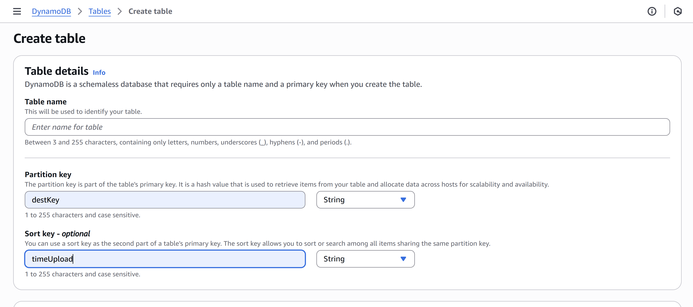
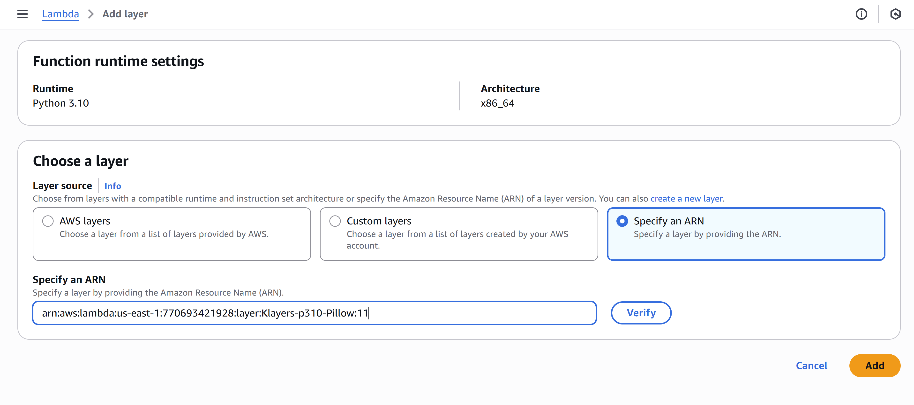
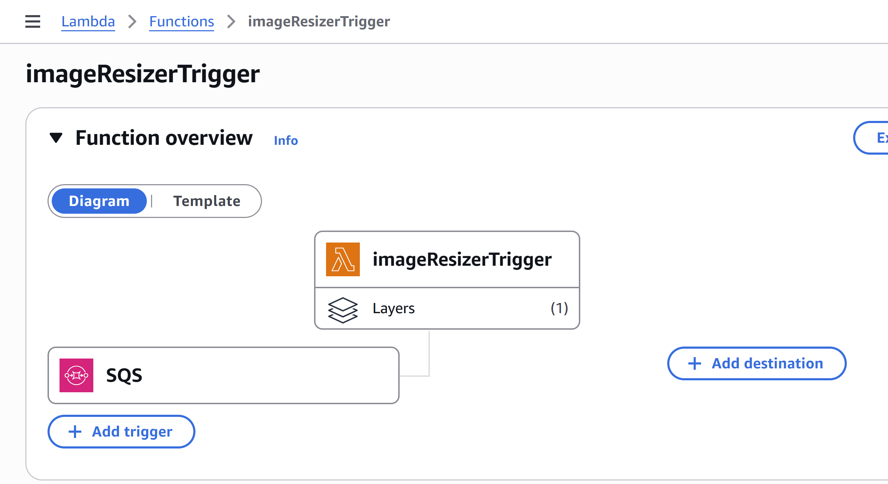
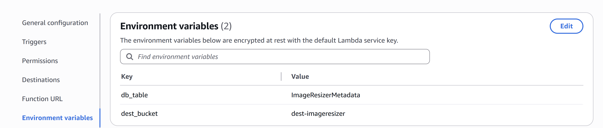
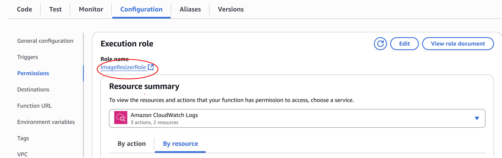
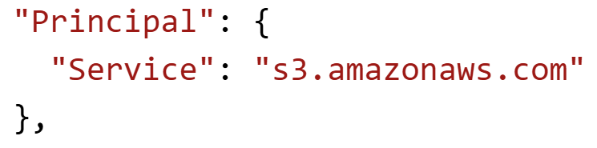

# Assets/image Resizer (Serverless)

System automatically resizes assets/images uploaded to an S3 source bucket,
stores a newly resized assets/image into a destination bucket, and logs metadata
of the operation into a DynamoDB table. Can debug problems using Cloudwatch Logs from the lambda function.
System follows principal of least privilege.

Flow: Client upload -> S3 -> SQS -> Lambda -> [S3 + DynamoDB + Cloudwatch]

## Creating the DynamoDB Table

Create an On-demand DynamoDB Table with partion key 'destKey' and sortKey 'timeUpload'


## Creating the SQS Queues

1. Create a standard SQS Queue with ```Redrive allow Policy``` ENABLED. 
2. Create another standard SQS Queue with ```DLQ``` (Dead-letter queue) ENABLED, and choose the DLQ you created
3. Can test if queue works by sending msg to DLQ and then starting a DLQ redrive. Should get a msg back in main queue.

## Creating the S3 Buckets
Make 2 S3 buckets, one for the source and one for the destination

### Adding Event Notifications
1. In your source bucket select ```Create event notification```, selecting ```All object create events``` under ```Event Types```.
2. Select ```SQS Queue``` under ```Destination``` and use the MAIN QUEUE ARN. 

## Creating the Lambda Function
1. Create a lambda function with ```Runtime``` Python.
2. Upload the ```lambda_function.py``` file as a .zip file to code source or copy the code into code source.
3. Copy the ARN found using this git repo https://github.com/keithrozario/Klayers/tree/master/deployments using your region and version for Package: ```Pillow```. 
4. Then go to Lamdba function page and select```Add a layer``` and then select ```Specify an ARN```. Copy and paste the ARN found from step 4. Then add layer.

5. Add the SQS queue via the ```Add trigger``` button. Should see figure 1 when done.

6. Go to ```Configuration``` in Lambda Home and then select ```Enviroment Variables```, then create 1 for the DynamoDB table with key 'db_table' and 1 for the destination bucket with key 'dest_bucket'.



## Adding Permissions

### Editing Execution Role for Lambda
Note for editing permissions, will be using visual policy editor.

1. Go to ```Configuration``` in Lambda Home and then select ```Permissions```, then select the exectution role.

2. Should be taken to IAM Page. Select ```Add Permissions``` then ```Create inline policy```

#### S3 Permissions
1. For ```Service``` select S3.
2. To allow read permissions, select ```Allow```, with ```getObject``` permission and ARN with your source bucket.
3. To allow write permissions, add another permission, then select ```Allow```, with ```putObject``` permission and ARN with your destination bucket.

#### DynamoDB Permissions
1. To allow write permissions, add permission with DynamoDB service, ```Allow```, with ```putItem``` permission and ARN with your DynamoDB table.

#### SQS Permissions
1. Add permission with SQS service, ```Allow```, with ```DeleteMessage```, ```ChangeMessageVisibility```, ```RecieveMessage```, ```getQueueAttributes``` with ARN of your MAIN QUEUE.


### SQS Main Queue Policy Edits
1. Go to your Main queue, then under ```Access Policy``` select ```edit```, then select ```Policy generator```.
2. Under ```Type of Policy```, select ```SQS Queue Policy```
3. Under ```Add statement(s)``` select ```Allow```
4. Under ```Principal``` add ```s3.amazonaws.com```
5. Under ```Actions``` select ```SendMessage```
6. Under ```Amazon Resource Name (ARN)``` choose your MAIN QUEUE ARN
7. Under ```Add conditions (optional)``` choose ```StringEquals```, ```sourceAccount```, ```<YourAWSAccount>``` in ```Condition```, ```Key```, and ```Value``` respectively.
8. Add another condition with ```ArnEquals```, ```sourceArn```, and ```<ARNofSourceBuckey>``` in ```Condition```, ```Key```, and ```Value``` respectively.
9. Generate policy, then edit ```Principal``` so it looks like this:

10. Paste policy into ```Access Policy``` to your Main Queue.


